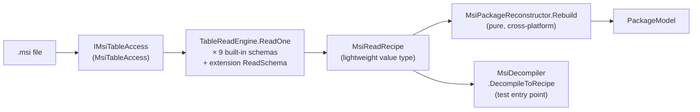

# Decompile Pipeline Architecture

## Why this exists

Before Cycle 4, `src/FalkForge.Decompiler/TableReaders/` contained nine static classes
(`PropertyTableReader`, `DirectoryTableReader`, `ComponentTableReader`, `FileTableReader`,
`FeatureTableReader`, `RegistryTableReader`, `ServiceTableReader`, `ShortcutTableReader`,
`UpgradeTableReader`) totalling 696 LOC. Each implemented the same four-step pattern with
copy-pasted structure: check `tableAccess.TableExists(name)`, call `tableAccess.QueryTable(name)`,
iterate rows by positional index (`row[0]`, `row[1]`), and construct a typed domain entry. The latent
bug class was column-index swapping — nothing caught positional-vs-declared mismatches. The extension
consequence was a round-trip gap: `IMsiTableContributor` extensions (Firewall, IIS, SQL, Dependency)
emitted custom tables during compile but the decompile path had no corresponding hook, so custom
tables were silently skipped. And because every test required real `msi.dll`, there were zero
isolated reader unit tests.

Cycle 4 replaces the nine copy-pasted readers with nine declarative `TableReadSchema` records driven
by a shared `TableReadEngine`, introduces `MsiReadRecipe` as a lightweight read-side intermediate
value type, splits the decompile pipeline into a thin Windows-only data-access stage and a pure
cross-platform reconstruction stage, and adds `IMsiTableContributor.ReadSchema` as the symmetric
decompile-side counterpart to Cycle 2's `ITableProducer`. The result is a pipeline that mirrors the
build-side `rules-as-data` design: all per-table knowledge lives in static record declarations, not
in imperative methods. See `docs/rules-as-data-architecture.md` for the write-side analogue.

---

## Pipeline diagram



`MsiDecompiler` is the public facade. Its `Decompile(msiPath)` method runs both stages and returns
`Result<PackageModel>`. Its `DecompileToRecipe(msiPath)` method stops after Stage 1 and returns
`Result<MsiReadRecipe>` — used by round-trip regression tests.

---

## Core types

| Type | Location | Description |
|---|---|---|
| `TableReadSchema<TRow>` | `FalkForge.Decompiler.Recipe` | Immutable `sealed record` — carries `TableName`, `ImmutableArray<ReadColumn>`, `RowMapper<TRow>`, and `DiagnosticCode`. One `static readonly` field per table in a per-area schema class. Implements `ITableReadSchema`. |
| `ReadColumn` | `FalkForge.Decompiler.Recipe` | `readonly record struct(string Name, ReadColumnType Type, bool Nullable, int Index)` — column descriptor. Stating `Index` explicitly prevents silent copy-paste index swaps. |
| `ReadColumnType` | `FalkForge.Decompiler.Recipe` | Enum: `String`, `Integer`. Drives type-safe parsing in `ReadRow`. |
| `ReadRow` | `FalkForge.Decompiler.Recipe` | `sealed class` — zero-stringly-typed view over one raw row. Column access via `ReadColumn` tokens: `String(col)`, `StringOrNull(col)`, `Int32(col)`, `Int32OrNull(col)`. Short-lived; not retained beyond the mapper call. |
| `RowMapper<TRow>` | `FalkForge.Decompiler.Recipe` | `delegate Result<TRow>(ReadRow row)` — pure mapping function from one row to one typed result. |
| `TableReadEngine` | `FalkForge.Decompiler.Recipe` | Static class. `ReadOne<TRow>(schema, access)` — drives one schema against one `ITableQuery`: checks table existence, queries columns by name, validates row shape, calls `RowMapper`, accumulates results. Returns empty list when table is absent. |
| `MsiReadRecipe` | `FalkForge.Decompiler.Recipe` | Lightweight value type carrying the 10 built-in typed collections (`Properties`, `Directories`, `Components`, `Files`, `Features`, `FeatureComponents`, `RegistryEntries`, `Services`, `Shortcuts`, `Upgrades`) plus `ExtensionRows` (`FrozenDictionary<string, IReadOnlyList<object>>`). |
| `MsiPackageReconstructor` | `FalkForge.Decompiler.Recipe` | Static class. `Rebuild(...)` — pure, cross-platform function converting `MsiReadRecipe` collections to `PackageModel`. Zero `IMsiTableAccess` touches. Unit-testable on Linux by hand-building recipe collections. |
| `IMsiTableContributor.ReadSchema` | `FalkForge.Extensibility` | Optional `ITableReadSchema?` property (default `null`). When non-null, `MsiDecompiler` reads the contributor's custom table and stores rows in `MsiReadRecipe.ExtensionRows`. |
| `ITableReadSchema` | `FalkForge.Extensibility` | Interface implemented by `TableReadSchema<TRow>` and by extension-specific implementations. Exposes `TableName`, `ReadErased(ITableQuery)` (type-erased read returning `Result<IReadOnlyList<object>>`). Lives in Extensibility so extensions have no Decompiler dependency. |

---

## Authoring a new built-in schema

Use `ComponentSchema` (`src/FalkForge.Decompiler/Recipe/Schemas/ComponentSchema.cs`, line 19) as the
reference pattern.

### 1. Define `ReadColumn` tokens

```csharp
// src/FalkForge.Decompiler/Recipe/Schemas/MyTableSchema.cs
namespace FalkForge.Decompiler.Recipe.Schemas;

public static class MyTableSchema
{
    public static readonly ReadColumn PrimaryKey = new("PrimaryKey", ReadColumnType.String,  false, 0);
    public static readonly ReadColumn Label      = new("Label",      ReadColumnType.String,  true,  1);
    public static readonly ReadColumn Count      = new("Count",      ReadColumnType.Integer, false, 2);
```

`Index` is the zero-based column position as returned by `IMsiTableAccess.QueryTable`. State it
explicitly — do not rely on array position matching.

### 2. Define the row record and `RowMapper<T>`

```csharp
    public sealed record MyTableRow(string PrimaryKey, string? Label, int Count);

    public static readonly TableReadSchema<MyTableRow> Schema = new(
        TableName: "MyTable",
        Columns:   [PrimaryKey, Label, Count],
        Map: row => Result<MyTableRow>.Success(new MyTableRow(
                row.String(PrimaryKey),
                row.StringOrNull(Label),
                row.Int32(Count))));
}
```

The `Map` delegate receives a `ReadRow` — use the column tokens, never positional strings. Return
`Result<MyTableRow>.Success(...)` on success, `Result<MyTableRow>.Failure(...)` on validation error.

### 3. Wire into `MsiDecompiler.ReadRecipeFromAccess`

Add a `TableReadEngine.ReadOne` call alongside the existing nine:

```csharp
// src/FalkForge.Decompiler/MsiDecompiler.cs  (ReadRecipeFromAccess method)
var myResult = TableReadEngine.ReadOne(MyTableSchema.Schema, access);
if (myResult.IsFailure) return Result<MsiReadRecipe>.Failure(myResult.Error);
```

Then include `myResult.Value` in the `MsiReadRecipe` constructor (add the property to `MsiReadRecipe`
first).

### 4. Add per-schema unit tests

Tests use `ITableQuery` inline stubs (or any implementation of `ITableQuery`). The test does not
need `msi.dll` and runs on any OS:

```csharp
// tests/FalkForge.Decompiler.Tests/Recipe/Schemas/MyTableSchemaTests.cs
[Fact]
public void MyTableSchema_maps_full_row()
{
    // Arrange: minimal ITableQuery stub returning two rows
    var query = new StubTableQuery("MyTable",
        columns: ["PrimaryKey", "Label", "Count"],
        rows:
        [
            ["key1", "First item", "3"],
            ["key2", null,         "0"],
        ]);

    // Act
    var result = TableReadEngine.ReadOne(MyTableSchema.Schema, query);

    // Assert
    Assert.True(result.IsSuccess);
    Assert.Equal(2, result.Value.Count);
    Assert.Equal("key1", result.Value[0].PrimaryKey);
    Assert.Equal(3,      result.Value[0].Count);
    Assert.Null(result.Value[1].Label);
}
```

---

## Adding extension read schemas

Implement `IMsiTableContributor.ReadSchema` on an existing contributor to make its custom table
round-trip through decompile.

### Option A — use the generic `TableReadSchema<TRow>`

Most straightforward. Works when the contributor is in a project that can reference
`FalkForge.Decompiler.Recipe`:

```csharp
public ITableReadSchema? ReadSchema => MyExtensionReadSchema.Instance;
```

```csharp
internal static class MyExtensionReadSchema
{
    private static readonly ReadColumn Name  = new("Name",  ReadColumnType.String, false, 0);
    private static readonly ReadColumn Value = new("Value", ReadColumnType.String, true,  1);

    internal static readonly TableReadSchema<MyExtRow> Instance = new(
        TableName: "MyExtTable",
        Columns:   [Name, Value],
        Map: row => Result<MyExtRow>.Success(new MyExtRow(row.String(Name), row.StringOrNull(Value))));
}
```

### Option B — implement `ITableReadSchema` directly (Firewall pattern)

Use when the contributor assembly cannot reference `FalkForge.Decompiler`. `ITableReadSchema` and
`ITableQuery` both live in `FalkForge.Extensibility` — no Decompiler dep needed.

The real Firewall implementation at
`src/FalkForge.Extensions.Firewall/FirewallTableReadSchema.cs` (line 11) is the canonical example.
It queries `WixFirewallException` with 11 columns, validates integer fields manually, and boxes
results as `IReadOnlyList<object>`. Key shape:

```csharp
// src/FalkForge.Extensions.Firewall/FirewallTableReadSchema.cs
internal sealed class FirewallTableReadSchema : ITableReadSchema
{
    internal static readonly FirewallTableReadSchema Instance = new();

    private static readonly string[] Columns =
        ["Name", "RemoteAddresses", "Port", "Protocol", "Program",
         "Profile", "Direction", "Action", "Component_", "Description", "Condition"];

    public string TableName => "WixFirewallException";

    public Result<IReadOnlyList<object>> ReadErased(ITableQuery query)
    {
        // check exists → query → validate row shape → parse integers → box results
        // ...
    }
}
```

Wire it on the contributor:

```csharp
// src/FalkForge.Extensions.Firewall/FirewallTableContributor.cs  (line 14)
public ITableReadSchema? ReadSchema => FirewallTableReadSchema.Instance;
```

`MsiDecompiler` calls `contributor.ReadSchema.ReadErased(access)` for each contributor with a
non-null schema and stores the results in `MsiReadRecipe.ExtensionRows[tableName]`.

---

## Round-trip test pattern

`DemoRoundTripTests` (`tests/FalkForge.Integration.Tests/DemoEndToEnd/DemoRoundTripTests.cs`)
verifies recipe stability for every MSI-producing demo. The load-bearing assertion tier is
**recipe-equality** — compile a demo, call `DecompileToRecipe`, assert core table collections are
populated:

```csharp
// tests/FalkForge.Integration.Tests/DemoEndToEnd/DemoRoundTripTests.cs (line 48)
[Theory]
[MemberData(nameof(RoundTripMsiDemosData))]
public void Msi_DecompileToRecipe_Succeeds(DemoExpectation demo)
{
    var build  = _fixture.GetOrBuild(demo);
    var result = new MsiDecompiler().DecompileToRecipe(build.OutputFile!);

    Assert.True(result.IsSuccess, ...);
    Assert.True(result.Value.Properties.Count > 0, ...);
    Assert.True(result.Value.Features.Count > 0, ...);
    // ... per-demo table checks driven by DemoExpectation.RequiredTables
}
```

To add a new demo to the round-trip suite:

1. Add a `DemoExpectation` entry in `DemoTestCatalog.MsiDemos` with the correct `RequiredTables`.
2. If the demo exercises an extension with a `ReadSchema`, verify `MsiReadRecipe.ExtensionRows`
   contains the expected table name and row count.
3. If the demo has files added only via `FeatureBuilder.Files(...)`, set `RoundTripSkipReason`
   until the `FeatureBuilder._files` write-side bug is fixed.

### Byte-identical round-trip status

The byte-identical tier (recompile decompiled recipe, byte-compare `.msi` files) is **not wired**.
`DemoRoundTripTests` documents the decision: byte-identical requires every demo to opt in to a pinned
`SOURCE_DATE_EPOCH` and a fixed `ProductCode`, which is a demo-authoring concern. Recipe-equality is
the load-bearing regression. Byte-identical is tracked as a follow-on.
