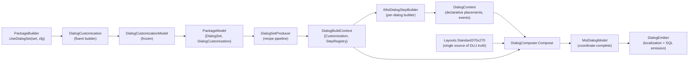

# Dialog Template Architecture

## Why This Exists

`SharedDialogBuilders.cs` was a 798-LOC static class whose seven builder methods
(`BuildWelcomeDlg`, `BuildLicenseAgreementDlg`, `BuildInstallDirDlg`, `BuildCustomizeDlg`,
`BuildProgressDlg`, `BuildExitDlg`, `BuildSetupTypeDlg`) placed every control by literal
integer coordinates. Button coordinates appeared 16 or more times across the file and
`MinimalDialogTemplate.cs`. The canonical symptom: changing the standard button width from
56 DLU to 70 DLU required touching roughly 16 sites; a missed site silently emitted a
mismatched width with no diagnostic.

The refactor introduced a named-region layout DSL (`DialogLayout`, `DialogRegion`,
`RegionPolicy`) and a pure composer (`DialogComposer.Compose`). Coordinate literals now live
in exactly one place — `Layouts.Standard370x270`. Per-dialog builders express their content
declaratively ("put Next and Cancel in ButtonRow") and never mention DLU coordinates. Five
dialog templates were rewritten from 60–150 LOC each to 46–89 LOC composers. A public
`DialogCustomization` fluent builder exposes the 5% caller surface (banner swap, button
relabelling, dialog suppression, extension step insertion). A `RegisterDialogStep` path on
`IExtensionRegistry` lets extensions contribute behaviour-carrying dialog steps.

---

## Lifecycle Diagram



`DialogCustomizationModel` also carries the `InsertedSteps` list; `DialogSetProducer`
queries `DialogStepRegistry` to resolve those step names and splice the builders into the
sequence before calling `Compose`.

---

## Core Types

| Type | Location | Purpose |
|------|----------|---------|
| `DialogLayout` | `Compiler.Msi/UI/Layout/DialogLayout.cs` | Named-region canvas definition. `CanvasWidth`/`CanvasHeight` + `ImmutableArray<DialogRegion>`. `TryGetRegion(name)` for O(1) lookup. `With(name, replacement)` produces override without mutation. |
| `DialogRegion` | `Compiler.Msi/UI/Layout/DialogRegion.cs` | One named area: `Bounds` (DLU), `Policy` (`RegionPolicy`), `Defaults` (`RegionDefaults`). |
| `RegionPolicy` | `Compiler.Msi/UI/Layout/RegionPolicy.cs` | Enum: `Absolute`, `RightPacked`, `TopStacked`, `SingleControl`. |
| `IRegionLayoutPolicy` | `Compiler.Msi/UI/Layout/IRegionLayoutPolicy.cs` | Strategy contract: `Resolve(region, controls) → IReadOnlyList<ResolvedControlPlacement>`. Four implementations: `AbsoluteRegionLayout`, `RightPackedRegionLayout`, `TopStackedRegionLayout`, `SingleControlRegionLayout`. |
| `DialogContent` | `Compiler.Msi/UI/Layout/DialogContent.cs` | Declarative dialog shape: `Name`, `Kind`, `Placements`, `Events`, `Conditions`, `EventMappings`, `FirstControl`, `DefaultControl`, `CancelControl`, `TitleLocKey`. No coordinates. |
| `PlacedControl` | `Compiler.Msi/UI/Layout/PlacedControl.cs` | One control in a region: `Name`, `Type` (MSI control type string), `TextOrLocKey`, `Property`, optional `OverrideX/Y/Width/Height`. |
| `DialogComposer` | `Compiler.Msi/UI/Layout/DialogComposer.cs` | Pure static class. `Compose(content, layout)` / `Compose(content, layout, customization?)` → `MsiDialogModel`. Applies region policies, then applies customization overrides (banner bitmap, header icon, button labels, window title). |
| `IMsiDialogStepBuilder` | `Compiler.Msi/UI/Layout/IMsiDialogStepBuilder.cs` | Internal compiler-side interface extending `IDialogStepBuilder`. Adds `Build(DialogBuildContext) → MsiDialogModel`. Stock builders and extension builders that need full layout implement this. |
| `DialogStepRegistry` | `Compiler.Msi/UI/Layout/DialogStepRegistry.cs` | Mutable during registration, frozen (`FrozenDictionary`) before template pipeline. `Register(IMsiDialogStepBuilder)`, `RegisterExtensionBuilder(IDialogStepBuilder)`, `TryGet(name)`, `Freeze()`. |
| `DialogBuildContext` | `Compiler.Msi/UI/Layout/DialogBuildContext.cs` | Immutable context passed to each `IMsiDialogStepBuilder.Build` call: `Customization` + `StepRegistry`. `ForTest(customization)` factory for unit tests. |
| `DialogFlowContext` | `Compiler.Msi/UI/Layout/DialogFlowContext.cs` | Navigation targets for a builder: `NextDialog`, `BackDialog`, `CancelDialog`. Passed into builder `Build` overloads so templates wire the chain. |
| `DialogCustomization` | `Core/Models/DialogCustomization.cs` | Public fluent builder. Methods: `BannerBitmap`, `DialogBitmap`, `HeaderIcon`, `WindowTitle`, `OverrideButtonLabel`, `SuppressDialog`, `InsertStep`. Freezes to `DialogCustomizationModel` via internal `ToModel()`. |

---

## Layouts.Standard370x270 Region Table

Single source of truth for all stock dialog DLU coordinates.
File: `src/FalkForge.Compiler.Msi/UI/Layout/Layouts.cs`

| Region | X | Y | Width | Height | Policy | Typical occupants |
|--------|---|---|-------|--------|--------|-------------------|
| `Banner` | 0 | 0 | 370 | 58 | `SingleControl` | Banner bitmap control |
| `TitleRow` | 15 | 6 | 200 | 15 | `Absolute` | Bold title `Text` control |
| `ContentArea` | 15 | 60 | 340 | 165 | `Absolute` | Description text, path edit, feature tree, progress bar, scrollable license text |
| `BottomLine` | 0 | 234 | 370 | 0 | `SingleControl` | Horizontal `Line` separator |
| `ButtonRow` | 0 | 243 | 360 | 17 | `RightPacked` | `PushButton` controls (Cancel, Back, Next/Install/Finish) |

`RightPacked` policy places buttons right-to-left from the region's right edge. Default
`RegionDefaults`: `ChildWidth = 56`, `ChildHeight = 17`, `Gap = 8` DLU. Per-control
`OverrideWidth` overrides the default when a button needs extra room.

No builder, template, or emitter outside `Layouts.cs` contains hardcoded DLU coordinates
for these five regions.

---

## Authoring a New Dialog Step

The following walkthrough uses `WelcomeDlgBuilder` as the reference.
File: `src/FalkForge.Compiler.Msi/UI/Layout/Builders/WelcomeDlgBuilder.cs`

**Step 1 — Declare the content.** Build a `DialogContent` that references regions by name.
No coordinates; the composer resolves them from the layout.

```csharp
internal static class WelcomeDlgBuilder
{
    public const string DialogName = "WelcomeDlg";

    public static DialogContent Build(DialogFlowContext flow)
    {
        var events = ImmutableArray.Create(
            new DialogControlEvent
            {
                Control = "Next",
                Event = "NewDialog",
                Argument = flow.NextDialog ?? string.Empty,
            },
            new DialogControlEvent
            {
                Control = "Cancel",
                Event = "SpawnDialog",
                Argument = flow.CancelDialog,
            });

        return new DialogContent
        {
            Name = DialogName,
            Kind = "Welcome",
            FirstControl = "Next",
            DefaultControl = "Next",
            CancelControl = "Cancel",
            TitleLocKey = "[ProductName] Setup",
            Events = events,
            Placements = ImmutableArray.Create(
                new RegionPlacement
                {
                    RegionName = "TitleRow",
                    Controls = ImmutableArray.Create(
                        new PlacedControl
                        {
                            Name = "Title",
                            Type = "Text",
                            TextOrLocKey = "{\\DlgFontBold8}!(loc.Dialog.Welcome.Title)",
                            OverrideWidth = 200,
                            OverrideHeight = 15,
                        }),
                },
                new RegionPlacement
                {
                    RegionName = "ButtonRow",
                    Controls = ImmutableArray.Create(
                        new PlacedControl { Name = "Cancel", Type = "PushButton",
                            TextOrLocKey = "!(loc.Button.Cancel)" },
                        new PlacedControl { Name = "Next",   Type = "PushButton",
                            TextOrLocKey = "!(loc.Button.Next)" }),
                }),
        };
    }
}
```

**Step 2 — Choose region policies.** `TitleRow` uses `Absolute` — the single title control
sits at the region's origin. `ButtonRow` uses `RightPacked` — the composer stacks Cancel
and Next right-to-left with a uniform 8 DLU gap. Content controls in `ContentArea` use
`Absolute` with `OverrideX`/`OverrideY` to fine-position within the region.

**Step 3 — Wire events.** Add `DialogControlEvent` entries (MSI `ControlEvent` table rows):
`NewDialog` for forward navigation, `EndDialog` for Install/Finish, `SpawnDialog` for
Cancel. Targets come from `DialogFlowContext` so the template controls the chain.

**Step 4 — Wire conditions.** Add `DialogControlCondition` entries (MSI `ControlCondition`
table rows) for `Enable`/`Disable`/`Show`/`Hide`/`Default` actions keyed on MSI property
expressions.

**Step 5 — Compose.** Call `DialogComposer.Compose` from the template that sequences the
dialogs:

```csharp
var model = DialogComposer.Compose(
    WelcomeDlgBuilder.Build(flow),
    Layouts.Standard370x270,
    context.Customization);
```

The returned `MsiDialogModel` carries fully resolved `X/Y/Width/Height` on every control
and is ready for `DialogEmitter`.

---

## Customizing a Dialog Set (5% Caller)

`PackageBuilder.UseDialogSet` accepts an optional `Action<DialogCustomization>` lambda.
The builder is frozen to an immutable `DialogCustomizationModel` stored on `PackageModel`
and consumed by `DialogComposer.Compose` at compile time.

```csharp
// src/FalkForge.Core/Builders/PackageBuilder.cs  lines 357-365
public PackageBuilder UseDialogSet(MsiDialogSet dialogSet, Action<DialogCustomization> configure)
{
    ArgumentNullException.ThrowIfNull(configure);
    _dialogSet = dialogSet;
    DialogCustomization customization = new();
    configure(customization);
    _dialogCustomization = customization;
    return this;
}
```

Typical caller:

```csharp
PackageBuilder.Create("MyApp", "1.0.0", "Acme Corp")
    .AddBinary("AcmeBanner",    "assets/banner.bmp")
    .AddBinary("AcmeWatermark", "assets/watermark.bmp")
    .UseDialogSet(MsiDialogSet.FeatureTree, dialogs => dialogs
        .BannerBitmap("AcmeBanner")
        .DialogBitmap("AcmeWatermark")
        .OverrideButtonLabel(DialogButton.Install, "!(loc.Button.Deploy)")
        .OverrideButtonLabel(DialogButton.Next, "Continue")
        .WindowTitle("Acme Studio [ProductName]"))
    .Build();
```

`DialogCustomization` verbs:

| Verb | Effect |
|------|--------|
| `BannerBitmap(key)` | Replaces `Text` of every `Bitmap`-typed control with `key` |
| `DialogBitmap(key)` | Reserved for welcome/exit background bitmaps (emitter-side) |
| `HeaderIcon(key)` | Replaces `Text` of every `Icon`-typed control with `key` |
| `WindowTitle(title)` | Overrides `MsiDialogModel.Title` on every composed dialog |
| `OverrideButtonLabel(button, label)` | Rewrites matching `PushButton.Text` via `DialogButtonNames.Map` |
| `SuppressDialog(dialog)` | Removes the stock dialog from the sequence (DLG002 validates navigation) |
| `InsertStep(stepName, after)` | Splices an extension step after the named stock dialog (DLG001 validates name) |

---

## Extension Dialog Step Contribution

Extensions contribute dialog steps in two parts:

**Part 1 — Register the step name** (required for DLG001 to pass):

```csharp
public sealed class LicensingExtension : IFalkForgeExtension
{
    public string Name => "Licensing";

    public void Register(IExtensionRegistry registry)
    {
        registry.RegisterDialogStep(new LicenseKeyDlgBuilder());
    }
}
```

`IDialogStepBuilder` (in `FalkForge.Extensibility`) only requires `string Name { get; }`.
This is sufficient for DLG001 name resolution. No MSI dialog is emitted unless the builder
also implements `IMsiDialogStepBuilder`.

**Part 2 — Implement `IMsiDialogStepBuilder`** (required to emit a dialog):

```csharp
// Requires a project reference to FalkForge.Compiler.Msi
internal sealed class LicenseKeyDlgBuilder : IMsiDialogStepBuilder
{
    public string Name => "LicenseKeyDlg";

    public MsiDialogModel Build(DialogBuildContext context)
    {
        var flow = new DialogFlowContext { CancelDialog = "CancelDlg" };
        return DialogComposer.Compose(
            new DialogContent
            {
                Name = "LicenseKeyDlg",
                Kind = "Extension",
                FirstControl = "Next",
                DefaultControl = "Next",
                CancelControl = "Cancel",
                TitleLocKey = "[ProductName] License Key",
                Placements = /* ... */,
                Events = /* ... */,
            },
            Layouts.Standard370x270,
            context.Customization);
    }
}
```

**Part 3 — Insert the step** from the package builder:

```csharp
PackageBuilder.Create("MyApp", "1.0.0", "Acme Corp")
    .UseExtension(new LicensingExtension())
    .UseDialogSet(MsiDialogSet.FeatureTree, dialogs => dialogs
        .InsertStep("LicenseKeyDlg", after: StockDialog.License))
    .Build();
```

See `docs/plugin-extensibility.md` — "Part 1 — Compile-Time Extensions" — for the full
extension authoring guide including `GetValidationRules()` and activation order.

---

## Validation

Two compile-time validators guard dialog customization correctness:

- **DLG001** — fired when `DialogCustomization.InsertStep(stepName, after:)` references a
  step name that is not present in `DialogStepRegistry` at compile time. Prevents silent
  no-ops where a typo in a step name produces a build that silently skips the intended
  dialog.

- **DLG002** — fired when `DialogCustomization.SuppressDialog(dialog)` would break the
  navigation chain. For example, suppressing the `License` dialog when `Welcome`'s `Next`
  button wires a `NewDialog` event to `LicenseAgreementDlg` leaves a dangling navigation
  target. DLG002 surfaces this at compile time rather than at install time.

Both codes follow the same rules-as-data pattern as every other FalkForge validator.
See `docs/rules-as-data-architecture.md` for how validation rules are authored, merged,
and suppressed.

---

## Reference

- `Layouts.Standard370x270` — `src/FalkForge.Compiler.Msi/UI/Layout/Layouts.cs` — single
  source of truth for stock dialog DLU coordinates. No hardcoded literals elsewhere.
- Per-dialog builders — `src/FalkForge.Compiler.Msi/UI/Layout/Builders/` — ten builders:
  `WelcomeDlgBuilder`, `LicenseDlgBuilder`, `InstallDirDlgBuilder`, `CustomizeDlgBuilder`,
  `ProgressDlgBuilder`, `ExitDlgBuilder`, `SetupTypeDlgBuilder`, `BrowseDlgBuilder`,
  `CancelDlgBuilder`, `InstallScopeDlgBuilder`.
- Five stock templates — `src/FalkForge.Compiler.Msi/UI/Templates/` — each 46–89 LOC,
  composing builders via `DialogComposer.Compose`.
- Dialog customization model — `src/FalkForge.Core/Models/DialogCustomization.cs` and
  `src/FalkForge.Core/Models/DialogCustomizationModel.cs`.
- Unit tests — `tests/FalkForge.Compiler.Msi.Tests/UI/Layout/` — per-composer, per-builder,
  and per-template test classes exercising coordinate regression, tab-chain integrity, event
  wiring, and customization overrides.
