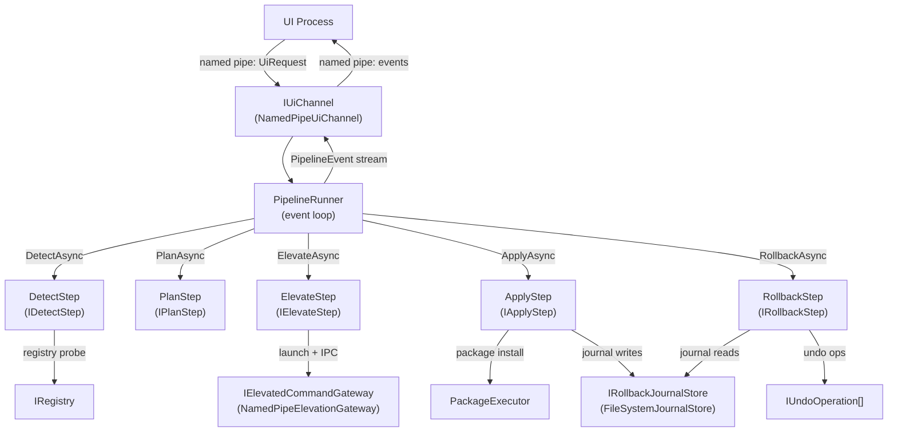

# Engine Pipeline Architecture

**Added:** 2026-05-11 | **Scope:** `src/FalkForge.Engine/Pipeline/`, `src/FalkForge.Engine/EngineSession.cs`

## Why this exists

Before Cycle 1, the engine implemented the install lifecycle as eleven `IEnginePhaseHandler` classes routed by a seventy-three-line `EngineStateMachine` switch-on-enum dispatcher. All eleven handlers read from and wrote to a single `EngineContext` mutable bag holding over thirty properties — `CurrentPhase`, `DetectedState`, `CurrentPlan`, `Variables`, `RebootRequired`, `FailedSegmentIndex`, and more. Preconditions between phases were implicit: nothing prevented calling a planning handler before detection had populated the state the planner needed, so a buggy or out-of-order call surfaced only as a null reference at runtime.

Cross-process boundaries bled into phase code directly. `ApplyingHandler` was four hundred and ninety lines long and personally owned action-loop orchestration, rollback journaling, elevation IPC framing, progress emission over the UI pipe, and error classification — referencing the UI pipe server, the elevated command client, the rollback journal, the package executor, the process runner, the restart manager, the variable store, and the payload downloader simultaneously. Every test that exercised a phase had to build the entire `EngineContext`, stub every dependency, and assert against bag mutations rather than observable outcomes.

Cycle 1 replaces this with a **Ports and Adapters** design. Every cross-boundary dependency is an explicit port interface in `src/FalkForge.Engine/Pipeline/`. Each port has a production adapter that wraps the real infrastructure and an in-memory test adapter in `src/FalkForge.Testing/`. The phase steps implement an internal `IPhaseStep` contract and are assembled into `InstallerPipeline` via `InstallerPipelineBuilder`. The public surface is `EngineSession`, a facade that wires the full production dependency graph and exposes a single `RunUntilShutdown` call. `EngineContext`, `EngineStateMachine`, `EngineHost`, and all eleven `IEnginePhaseHandler` implementations are deleted.

---

## Lifecycle diagram



`PipelineRunner` owns the event loop: it reads `UiRequest` items from `IUiChannel`, dispatches them to the corresponding `IInstallerPipeline` phase method, and fans resulting `PipelineEvent` records back to the channel. Phase steps communicate via `PipelineContext` (an internal record threaded through each step call), not through a mutable shared bag.

---

## Port table

| Port | Owner module | Production adapter | In-memory test adapter |
|---|---|---|---|
| `IUiChannel` | `Engine.Pipeline` | `NamedPipeUiChannel` | `FakeUiChannel` (Testing) |
| `IElevatedCommandGateway` | `Engine.Pipeline` | `NamedPipeElevationGateway` | `InProcessElevationGateway` (Testing) |
| `IPayloadSource` | `Engine.Pipeline` | `HttpPayloadSource` | `InMemoryPayloadSource` (Testing) |
| `IRollbackJournalStore` | `Engine.Pipeline` | `FileSystemJournalStore` | `InMemoryJournalStore` (Testing) |
| `IPayloadCache` | `Engine.Pipeline` | `DiskPayloadCache` | `DictPayloadCache` (Testing) |
| `ILayoutStore` | `Engine.Pipeline` | `FileSystemLayoutStore` | `InMemoryLayoutStore` (Testing) |
| `ISystemClock` | `Engine.Pipeline` | `SystemClock` | `FakeClock` (Testing) |
| `IRandomSource` | `Engine.Pipeline` | `CryptoRandomSource` | `DeterministicRandom` (Testing) |
| `IFileSystem` | `Platform` | `WindowsFileSystem` | `MockFileSystem` (Testing) |
| `IMsiApi` | `Platform.Windows` | `WindowsMsiApi` | `FakeMsiApi` (Testing) |
| `IProcessRunner` | `Engine.Execution` | `ProcessRunner` | `FakeProcessRunner` (Testing) |
| `IRestartManager` | `Engine.RestartManager` | `RestartManagerSession` | `NullRestartManager` (Testing) |
| `IFalkLogger` | `Diagnostics` (Core) | `EngineLogger` | `ListLogger` (Testing) |

---

## Phase step table

| Step | Role | Key inputs | Key outputs |
|---|---|---|---|
| `DetectStep` | Probe installed state | `InstallerManifest`, `IRegistry` | Detected product version + install state written to `PipelineContext` |
| `PlanStep` | Compute action list | `UiRequest.Plan` (feature selections, install dir, properties), detected state | `InstallPlan` written to `PipelineContext`; conditions evaluated via `VariableStore` |
| `ElevateStep` | Launch elevated companion | `IElevatedCommandGateway`, pipe handshake timeout | Elevation gateway active; `ErrorKind.ElevationError` on failure |
| `ApplyStep` | Execute packages + journal | `PackageExecutor`, `IRollbackJournalStore`, `UiRequest` for property injection | Packages installed/removed; journal entries appended; `PipelineEvent.Progress` emitted |
| `RollbackStep` | Undo applied changes | `IRollbackJournalStore`, `IUndoOperation[]` | Journal entries replayed in reverse; `PipelineEvent.RollbackStep` emitted per entry |

---

## Worked example: test pipeline using `InstallerPipelineBuilder` with in-memory adapters

From `tests/FalkForge.Engine.Tests/Pipeline/InstallerPipelineTests.cs` (lines 14–130):

```csharp
// Minimal pipeline — no manifest, no registry, no executor, no journal.
// All phase steps degrade gracefully when their required components are absent.
private static IInstallerPipeline Build() =>
    new InstallerPipelineBuilder().Build();

private static UiRequest.Plan DefaultPlan() =>
    new UiRequest.Plan(
        InstallAction.Install,
        InstallDirectory: null,
        FeatureSelections: new Dictionary<string, bool>(),
        Properties: new Dictionary<string, string>(),
        SecureProperties: new Dictionary<string, SensitiveBytes>());

[Fact]
public async Task PlanAsync_Succeeds_AfterDetect()
{
    await using var pipeline = Build();
    await pipeline.DetectAsync(CancellationToken.None);
    var result = await pipeline.PlanAsync(DefaultPlan(), CancellationToken.None);
    Assert.True(result.IsSuccess);
}

[Fact]
public async Task PlanAsync_BeforeDetect_Returns_Failure()
{
    await using var pipeline = Build();
    // Intentionally skip DetectAsync — pipeline enforces ordering
    var result = await pipeline.PlanAsync(DefaultPlan(), CancellationToken.None);
    Assert.True(result.IsFailure);
    Assert.Equal(ErrorKind.EngineError, result.Error.Kind);
}
```

For a fully wired test pipeline with real phase-step logic, supply all required components:

```csharp
var fakeChannel  = new FakeUiChannel();
var journalStore = new InMemoryJournalStore();
var fakeMsiApi   = new FakeMsiApi();
var fakeRegistry = new MockRegistry();

await using var pipeline = new InstallerPipelineBuilder()
    .WithManifest(manifest)
    .WithRegistry(fakeRegistry)
    .WithPackageExecutor(packageExecutor)
    .WithVariableStore(new VariableStore())
    .WithJournalStore(journalStore)
    .WithUndoOperations(undoOperations)
    .WithUiChannel(fakeChannel)
    .WithClock(new FakeClock(DateTimeOffset.UtcNow))
    .WithRandom(new DeterministicRandom(seed: 42))
    .WithLogger(new ListLogger())
    .Build();

await pipeline.DetectAsync(CancellationToken.None);
await pipeline.PlanAsync(planRequest, CancellationToken.None);
var result = await pipeline.ApplyAsync(CancellationToken.None);

Assert.True(result.IsSuccess);
Assert.Empty(journalStore.Entries);          // all entries cleared on success
```

---

## Worked example: production wiring via `EngineSession.BindToPipe`

From `src/FalkForge.Engine/Program.cs` (the core session block — argument parsing and bootstrapper mode omitted for clarity):

```csharp
// Receive shared secret via init pipe (avoids passing secrets on the command line).
// pipeName and secretPipeName are parsed from --pipe / --secret-pipe args.
using var cts = new CancellationTokenSource();
Console.CancelKeyPress += (_, e) => { e.Cancel = true; cts.Cancel(); };

await using var session = EngineSession.BindToPipe(
    pipeName,
    manifestPath,
    new EngineSessionOptions
    {
        PipeOptions       = pipeOptions,       // contains shared secret for HMAC handshake
        LogPath           = programArgs.LogPath,
        MinimumLogLevel   = programArgs.MinimumLogLevel
    });

var outcome = await session.RunUntilShutdown(cts.Token);
return outcome.State switch
{
    EngineTerminalState.Completed  => 0,
    EngineTerminalState.Cancelled  => 2,
    EngineTerminalState.RolledBack => 3,
    EngineTerminalState.Failed     => 1,
    _                              => 1
};
```

`EngineSession.BindToPipe` (`src/FalkForge.Engine/EngineSession.cs`) constructs the entire production dependency graph internally: logger with pipe callback fan-out, manifest deserialization, instance lock (per-bundle global mutex), `NamedPipeUiChannel` with HMAC options, `WindowsPlatformServices`, all five package executors, `FileSystemJournalStore`, undo operations, `NamedPipeElevationGateway`, `VariableStore`, and the `InstallerPipelineBuilder` wiring. No caller touches any of these types.

For tests, `EngineSession.BindToChannel(fakeChannel, options?)` is the internal test entry point — same lifetime management, no named-pipe setup.

---

## Determinism: `ISystemClock` and `IRandomSource`

Two small ports eliminate all non-deterministic behavior from pipeline code:

- **`ISystemClock`** — wraps `DateTime.UtcNow`. Production: `SystemClock`. Tests: `FakeClock(DateTimeOffset start)` — frozen by default, advanceable via `Advance(TimeSpan)`. Any code that computes timestamps, timeouts, or retry back-off intervals against the clock is deterministic in tests.

- **`IRandomSource`** — wraps `RandomNumberGenerator.Fill` and `Guid.NewGuid()`. Production: `CryptoRandomSource`. Tests: `DeterministicRandom(seed)` — seeded PRNG, stable GUIDs. Any code that generates correlation IDs, journal entry identifiers, or nonce values is reproducible in tests.

With both ports in play, two runs of the same test with the same inputs produce byte-identical event streams, log content, and journal entries — enabling golden-file assertion patterns and reliable regression detection.

---

## Cancellation propagation

`CancellationToken` flows from the caller all the way into port calls:

1. `EngineSession.RunUntilShutdown(ct)` catches `OperationCanceledException` when `ct` fires and returns `EngineTerminalState.Cancelled` immediately.
2. Inside `PipelineRunner.RunAsync(ct)`, the token is threaded through every `IInstallerPipeline` phase call: `DetectAsync(ct)`, `PlanAsync(request, ct)`, `ElevateAsync(ct)`, `ApplyAsync(ct)`.
3. Each phase step forwards the token into port calls — `IPayloadSource.DownloadAsync(..., ct)`, `IElevatedCommandGateway` operations, `PackageExecutor` invocations.
4. `RollbackAsync` is always called with `CancellationToken.None`. A user cancel that triggers rollback must not also cancel the rollback itself — the undo work must complete even if the original operation was cancelled.

When `ApplyAsync` is interrupted by cancellation, `PipelineRunner` invokes `RollbackAsync(CancellationToken.None)` before returning exit code 3. The `EngineSession` maps exit code 3 to `EngineTerminalState.RolledBack`.

---

## Rollback: `IRollbackJournalStore` + `RollbackStep`

`IRollbackJournalStore` has three operations:

- `Append(JournalEntry)` — called by `ApplyStep` after each package operation succeeds. `FileSystemJournalStore` flushes to disk with `Flush(true)` so entries survive a process crash mid-apply.
- `LoadAll()` — called by `RollbackStep` to retrieve all recorded entries.
- `Clear()` — called by `RollbackStep` after successful rollback, and by `ApplyStep` after a clean successful apply.

`RollbackStep` reads the journal, iterates entries in reverse, dispatches each to the matching `IUndoOperation` implementation (`MsiUninstallOperation`, `ExeRollbackOperation`, `CacheCleanupOperation`), and emits a `PipelineEvent.RollbackStep` for each outcome.

**Crash recovery:** if a prior session wrote journal entries but did not clear them (process killed mid-apply), the journal is non-empty when `EngineSession.BindToPipe` constructs the pipeline. `RollbackStep` will replay those entries on the next `RollbackAsync` call. `PipelineRunner` detects the non-empty journal at startup and routes directly to rollback before accepting any UI requests — the first event the UI sees is `PipelineEvent.PhaseChanged(EnginePhase.RollingBack)`.

**In-memory test analog:** `InMemoryJournalStore` stores entries in a `List<JournalEntry>` and exposes a `SimulateCrashAfter(n)` hook that makes subsequent `Append` calls throw while preserving prior entries — proving the crash-durability contract without writing any files.
