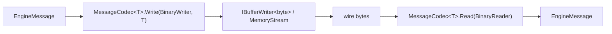

# Protocol Codec Architecture

**Added:** 2026-05-11 | **Scope:** `src/FalkForge.Engine.Protocol/Serialization/`

## Why this exists

The original `MessageSerializer` and `MessageDeserializer` were paired switch statements — 191 and 238 lines respectively — that dispatched on 28 concrete message types and wrote or read fields by hand. This caused two structural problems:

**Paired-switch fragility.** Adding a new message type required touching both files in lockstep. A field added on the write side but missed on the read side produced silent data corruption rather than a compile error. There was no enforcement mechanism.

**Secure-property lifecycle bug.** `SetSecurePropertyMessage.SecureValue` was typed `byte[]`, which left plaintext in heap memory indefinitely. The caller had no way to zero it after serialization, and the deserializer returned a live `byte[]` reference with no disposal contract.

Additionally, the original design had no version evolution path: the wire format was fixed, and any schema change would require a flag day across all connected processes.

## Pipeline



The wire frame header is `[wireVersion:u16][type:u16][payloadLength:i32]`, written by `MessageSerializer` before dispatching to the codec. The codec body begins with `SequenceId (u32)` then type-specific fields. `MessageDeserializer` reads the header, resolves the codec via `MessageCodecRegistry.ForRead(type, wireVersion)`, then hands the `BinaryReader` to the codec.

## Core types

| Type | Description |
|------|-------------|
| `IMessageCodec` | Non-generic interface: `Type`, `WireVersion`, `MessageClrType`, `ReadErased(BinaryReader)`, optional `PostWrite` hook |
| `MessageCodec<T>` | Generic record implementing `IMessageCodec`. Static singleton per message type. Fields: `Write`, `Read`, `Fields`, `PostWrite` |
| `MessageCodecRegistry` | Static registry mapping `CodecKey` → `IMessageCodec`. `Register(codec)` and `ForRead(type, version)` with nearest-lower-version fallback |
| `MessageCodecRegistryInstance` | Calls `Register` for all 28 shipped codecs at startup |
| `CodecKey` | `readonly record struct (MessageType Type, ushort WireVersion)` — the registry key |
| `FieldDescriptor` | Describes one field: index, name, `WireType`, nullable flag |
| `FieldInterpreter` | Schema walker: reads a payload and maps each field descriptor to its consumed bytes |
| `WireType` | Enum of supported primitive wire types: `UInt32`, `Int32`, `Int64`, `Boolean`, `String`, `Bytes` |

## Authoring a new message codec

This worked example uses `CancelCodec` — one of the simplest codecs.

**Step 1 — Define the message record** in `Messages/`:

```csharp
// Messages/CancelMessage.cs
public sealed class CancelMessage : EngineMessage
{
    public override MessageType Type => MessageType.Cancel;
}
```

**Step 2 — Add a `MessageType` enum value** in `Messages/MessageType.cs`:

```csharp
Cancel = 0x0102,
```

**Step 3 — Define `MessageCodec<T>` in `Codecs/CancelCodec.cs`:**

```csharp
internal static class CancelCodec
{
    public static readonly MessageCodec<CancelMessage> Instance = new()
    {
        Type = MessageType.Cancel,
        WireVersion = 1,
        Fields = ImmutableArray.Create(
            new FieldDescriptor { Index = 0, Name = nameof(EngineMessage.SequenceId), Type = WireType.UInt32, Nullable = false }),
        Write = static (writer, message) =>
        {
            writer.Write(message.SequenceId);
        },
        Read = static reader => new CancelMessage
        {
            SequenceId = reader.ReadUInt32(),
        },
    };
}
```

**Step 4 — Register in `MessageCodecRegistryInstance`:**

```csharp
MessageCodecRegistry.Register(CancelCodec.Instance);
```

**Step 5 — Add per-codec round-trip and golden-byte tests** in `Codecs/CancelCodecTests.cs`:

```csharp
[Fact]
public void RoundTrip_preserves_all_fields()
{
    var message = new CancelMessage { SequenceId = 0xCAFEBABE };
    // ... write via codec, read back, assert fields equal
}

[Fact]
public void GoldenBytes_wire_format_stable()
{
    // Golden bytes lock the wire format against accidental drift.
    var expected = Convert.FromHexString("010001020400000007000000");
    var actual = MessageSerializer.Serialize(new CancelMessage { SequenceId = 7 });
    Assert.Equal(expected, actual);
}
```

The golden-byte hex string is computed once from `MessageSerializer.Serialize` and then hardcoded. If the wire format changes accidentally, this test fails immediately.

## Secure property lifecycle

`SetSecurePropertyMessage` is `IDisposable`. Its `SecureValue` field is typed `SensitiveBytes` — a `readonly struct` wrapping a `byte[]` that zeroes its backing array on `Dispose`.

`SetSecurePropertyCodec` implements three-layer zeroing defense:

**Layer 1 — write-side reveal buffer.** `SensitiveBytes.Borrow()` returns a scoped `RevealHandle` exposing the plaintext as a `ReadOnlySpan<byte>`. The codec writes through this span into the `BinaryWriter`. When the `RevealHandle` is disposed (end of `Write`), the span goes away — but the underlying `SensitiveBytes` still holds the plaintext until the message itself is disposed.

**Layer 2 — read-side scratch buffer.** On deserialization, the codec rents a buffer from `ArrayPool<byte>.Shared`, reads the raw payload bytes into it, then wraps them immediately in `SensitiveBytes.FromPlaintext` (which copies into a fresh, privately-owned backing array). The scratch buffer is then explicitly zeroed via `CryptographicOperations.ZeroMemory` and returned to the pool with `clearArray: true`.

**Layer 3 — PostWrite hook.** `MessageCodec<T>` supports an optional `PostWrite` delegate called by `MessageSerializer.Serialize` after framing completes. `SetSecurePropertyCodec` sets this to `msg => msg.Dispose()`, which zeroes the message's `SensitiveBytes` immediately after the wire bytes are written — so one-shot messages do not leak even if the caller omits a `using` block.

See `src/FalkForge.Engine.Protocol/Serialization/Codecs/SetSecurePropertyCodec.cs` for the full implementation.

## Version negotiation

Each codec is keyed by `(MessageType, WireVersion)`. When `MessageCodecRegistry.ForRead` receives a `(type, wireVersion)` pair, it looks for an exact match first, then falls back to the nearest registered version below the requested version. This allows the registry to contain both a `V1` and a `V2` codec for the same message type simultaneously.

Example: `LogCodec` and `PhaseChangedCodec` were promoted to `WireVersion = 2` to append a 16-byte `SessionCorrelationId` (a `Guid`) to the payload. A process running the old V1 wire format can still be deserialized by the V1 fallback codec; a process running V2 gets the full `SessionCorrelationId`.

To add a V2 codec for an existing message type, register a new `MessageCodec<T>` with `WireVersion = 2` alongside the existing V1 codec. The `V1` registration remains intact; `ForRead` will use it for any caller that sends `wireVersion = 1`.
