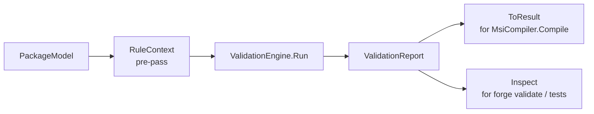

# Rules-as-Data Validation Architecture

## Why this exists

`ModelValidator.cs` was a 519-line static god class with 23 private methods and 61 hardcoded string-literal error codes, no central rule registry, and no testability seam below the orchestrator level. Every rule existed as an inline `AddError(code, message)` call; four parallel validator silos (`ModelValidator`, `PatchValidator`, `MergeModuleValidator`, `TransformValidator`) duplicated rules across targets; extension-specific validators ran in isolation and their errors were silently swallowed by some compile paths. There was no way to query rule metadata, suppress individual rules at the CLI, or let an extension contribute diagnostics that appear alongside core rules.

The rules-as-data rewrite replaces imperative control flow with an immutable `ValidationRule` record stored in a flat `RuleRegistry`. Each rule is a typed value with an ID, severity, section, title, description, and a pure `Evaluate` delegate. A per-run `RuleContext` pre-builds shared indexes once so every rule gets O(1) cross-table lookups without re-walking the model. A thin `ModelValidator` facade preserves the one-line `Check(package)` call surface used by `MsiCompiler.Compile` while `Inspect(package)` returns the full structured report needed by `forge validate` and tests.

---

## Core types

| Type | Description |
|---|---|
| `ValidationRule` | Immutable `sealed record` — carries `RuleId`, `Severity`, `ModelSection`, `Title`, `Description`, and an `Evaluate` delegate. One `public static readonly` field per rule in a per-area class. |
| `RuleId` | `readonly record struct(string Value)` — typed rule identifier (e.g. `"PKG001"`). Exposes `Prefix` (`"PKG"`) extracted once at construction. Implicitly converts to `string`. |
| `RuleContext` | Per-run context built once in an O(n) pre-pass. Exposes `Package`, `FeaturesById`, `CustomTablesByName`, and `FeatureWalk`. Rules read it; they never mutate it. |
| `RuleRegistry` | Immutable collection of `ValidationRule` instances. Filter operations (`Without`, `WithAdded`, `OverrideSeverity`, `FilterSection`) return new registries; never mutate. Backed by a `FrozenDictionary` for O(1) lookup by `RuleId`. |
| `ValidationEngine` | Pure orchestrator — `Run(PackageModel, ValidationOptions?)` builds `RuleContext`, walks the registry, accumulates `Violation`s, returns a `ValidationReport`. |
| `ValidationReport` | `sealed record(ImmutableArray<Violation>)` — exposes `IsValid`, `Errors`, `Warnings`, `ToResult()`, and `ByRule()`. |
| `Violation` | `sealed record(RuleId, Severity, ModelPath, Message)` — one finding from one rule on one run. |
| `ModelPath` | `readonly record struct` — typed path through the model (e.g. `"package.Features[2].Services[0].Name"`). Built only when a violation fires; never allocated on the happy path. |
| `ValidationOptions` | Immutable record — `IgnoredRules`, `WarningsAsErrors`, `StopOnFirstError`, optional `Rules` override. |
| `CoreRuleCatalog` | Static class exposing `Package`, `MergeModule`, `Patch`, `Transform` registries. Each built once at module load. |

---

## Lifecycle



1. Caller passes `PackageModel` to `ModelValidator.Check` (or `Inspect`).
2. `ValidationEngine` builds `RuleContext` in a single O(n) pass over the model, constructing `FeaturesById`, `CustomTablesByName`, and the depth-first `FeatureWalk` list.
3. The engine iterates every `ValidationRule` in the registry, calling `Evaluate(ctx)` and collecting `Violation`s.
4. Results accumulate into a `ValidationReport`.
5. `ToResult()` collapses violations to `Result<Unit>` for the compiler path. `Inspect` returns the full report for CLI / test consumers.

---

## Authoring a new rule

### 1. Choose a `RuleId`

Rule IDs use a three-letter prefix per model area:

| Prefix | Area |
|---|---|
| `PKG` | Package top-level metadata |
| `FEA` | Features |
| `SVC` | Services |
| `REG` | Registry |
| `CTB` | Custom tables |
| `SHC` | Shortcuts |
| `FNT` | Fonts |
| `INI` | INI files |
| `PRM` | Permissions |
| `FAS` | File associations |
| `MUP` | Major upgrades |
| `DNG` | Downgrade rules |
| `MSM` | Merge module rules |
| `MSP` | Patch rules |
| `MST` | Transform rules |
| `FWL` | Firewall extension |
| `DEP` | Dependency extension |
| `IIS` | IIS extension |
| `SQL` | SQL extension |
| `NET` | .NET extension |
| `XCF` | Util extension |

Pick the next unused number in the series (e.g. `PKG012` if `PKG011` is the current last).

### 2. Add a `static readonly` field to the appropriate per-area class

Per-area classes live in `src/FalkForge.Core/Validation/`:
`PackageRules`, `FeatureRules`, `ServiceRules`, `CustomTableRules`, `MiscRules` (shortcuts, fonts, INI, permissions, file associations), `RemainingRules` (MajorUpgrade, signing, etc.).

**Scalar check** — use `ValidationRule.Single`:

```csharp
// src/FalkForge.Core/Validation/PackageRules.cs

/// <summary>PKG001 — Package Name is required.</summary>
public static readonly ValidationRule Pkg001_NameRequired = ValidationRule.Single(
    new RuleId("PKG001"),
    Severity.Error,
    ModelSection.Package,
    "Name required",
    "Package Name must not be null, empty, or whitespace-only.",
    static ctx => string.IsNullOrWhiteSpace(ctx.Package.Name)
        ? new Violation(new RuleId("PKG001"), Severity.Error,
            ModelPath.Root.Field("Name"),
            "Package Name is required.")
        : null);
```

**Iteration rule** — use the raw constructor with a `static` lambda:

```csharp
// src/FalkForge.Core/Validation/ServiceRules.cs

/// <summary>SVC005 — Account=User requires UserName.</summary>
public static readonly ValidationRule Svc005_UserAccountRequiresUserName =
    new(new RuleId("SVC005"),
        Severity.Error,
        ModelSection.Service,
        "User account requires UserName",
        "A service configured with Account=User must specify UserName.",
        static ctx => ctx.Package.Features
            .SelectMany(f => f.Components)
            .SelectMany(c => c.Services)
            .Where(s => s.Account == ServiceAccount.User && string.IsNullOrWhiteSpace(s.UserName))
            .Select((s, i) => new Violation(
                new RuleId("SVC005"), Severity.Error,
                ModelPath.Root.Field("Services").Index(i).Field("UserName"),
                $"Service '{s.Name}' has Account=User but no UserName.")));
```

Use `static` on all lambda expressions. The C# compiler enforces closure-free delegates, which prevents accidental heap captures.

### 3. Add the field to the class's `All` array

```csharp
public static readonly ValidationRule[] All =
[
    // ... existing rules ...
    Pkg012_YourNewRule,
];
```

`CoreRuleCatalog.BuildPackage()` includes each area's `All` array — no other wiring needed.

### 4. Write a per-rule unit test

Tests live in `tests/FalkForge.Core.Tests/Validation/`. Create a test class named after the rule:

```csharp
// tests/FalkForge.Core.Tests/Validation/Pkg001_NameRequiredTests.cs

public sealed class Pkg001_NameRequiredTests
{
    [Fact]
    public void Empty_name_yields_PKG001_error()
    {
        var package = PackageFactory.MinimalValid() with { Name = "" };
        var ctx = RuleContext.ForTest(package);

        var violations = PackageRules.Pkg001_NameRequired.Evaluate(ctx).ToList();

        Assert.Single(violations);
        Assert.Equal("PKG001", violations[0].RuleId.Value);
        Assert.Equal(Severity.Error, violations[0].Severity);
    }

    [Fact]
    public void Valid_name_yields_no_violations()
    {
        var package = PackageFactory.MinimalValid();
        var ctx = RuleContext.ForTest(package);

        Assert.Empty(PackageRules.Pkg001_NameRequired.Evaluate(ctx));
    }
}
```

`RuleContext.ForTest(package)` builds a fully populated context without requiring the full engine.

### 5. Cross-table rules — use context indexes

When a rule needs to correlate two collections (e.g., check that every `FeatureComponentRef` points to a real component), use the pre-built indexes on `RuleContext`:

```csharp
static ctx => ctx.Package.Features
    .SelectMany(f => f.ComponentRefs)
    .Where(r => !ctx.ComponentsById.ContainsKey(r.ComponentId))
    .Select(r => new Violation(
        new RuleId("FEA010"), Severity.Error,
        ModelPath.Root.Field("Features").Field(r.FeatureId).Field("ComponentRefs"),
        $"FeatureComponentRef '{r.ComponentId}' does not reference a known component."))
```

Do not walk the model again inside the delegate. `ComponentsById` and `FeaturesById` are `FrozenDictionary<string, …>` built in the pre-pass; every lookup is O(1).

For rules that need to iterate the feature tree in depth-first order use `ctx.FeatureWalk` — a pre-flattened `ImmutableArray<FeatureWalkEntry>` with `Feature`, `Depth`, and `Path` on each entry.

---

## Adding extension rules

Extensions contribute rules via `GetValidationRules()` on `IFalkForgeExtension`. The default implementation returns an empty array; override it to contribute rules.

```csharp
// src/FalkForge.Extensions.Firewall/FirewallExtension.cs

public sealed class FirewallExtension : IFalkForgeExtension
{
    public FirewallTableContributor TableContributor { get; } = new();

    public string Name => "Firewall";

    public void Register(IExtensionRegistry registry)
    {
        registry.RegisterTableContributor(TableContributor);
    }

    /// <inheritdoc/>
    public ImmutableArray<ValidationRule> GetValidationRules()
        => FirewallRules.Build(() => TableContributor.Rules);
}
```

`FirewallRules.Build` returns `ImmutableArray<ValidationRule>` where each rule closes over the extension-instance rule list via the `Func<IReadOnlyList<FirewallRuleModel>> getRules` parameter. This lets rules always read the live collection populated by `AddRule(...)` calls, not a snapshot taken at construction time.

Rules contributed by extensions are merged into the singleton `CoreRuleCatalog.Package` registry (via `ModelValidator.RegisterExtensionRules`) during `MsiAuthoring.Compile`, so they appear in `forge rules list`, in `forge validate` output, and in `ModelValidator.ListRules()` — alongside all core rules.

Use section values from the `ModelSection.Extension_*` block (`Extension_Firewall`, `Extension_Iis`, `Extension_Sql`, `Extension_Dependency`, `Extension_DotNet`, `Extension_Util`) so CLI filtering by `--section` correctly scopes extension rules.

---

## CLI usage

### List rules

```
forge rules list
```

Lists all rules for the default `package` target. Columns: ID, severity, section, title.

```
forge rules list --target patch --section MajorUpgrade --severity Error --json
```

Filter by target, section, and severity; emit machine-readable JSON (includes `description`).

### Explain a rule

```
forge rules explain PKG009
```

Prints the full metadata for rule `PKG009` — ID, severity, section, title, and description.

### Validate with suppressions

```
forge validate installer.cs --ignore PKG004,PKG011
```

Suppress specific rules by ID. Accepts comma-separated values or repeated `--ignore` flags.

### Warnings as errors

```
forge validate installer.cs --warn-as-error
```

Promotes all `Warning`-severity violations to `Error`. Exit code 1 if any warnings exist.

### Stop on first error

```
forge validate installer.cs --stop-on-first-error
```

Engine halts after the first `Error` violation. Useful in tight feedback loops.

---

## Severity semantics

| Severity | Behaviour |
|---|---|
| `Error` | Blocks compilation. `ModelValidator.Check` returns `Result.Failure`. `forge validate` exits with code 1. |
| `Warning` | Informational — compilation proceeds. Surfaced by `forge validate` in yellow. Promoted to `Error` when `--warn-as-error` is set. |
| `Info` | Informational only. Never blocks compilation. Never promoted by `--warn-as-error`. Reserved for future diagnostic tiers. |
